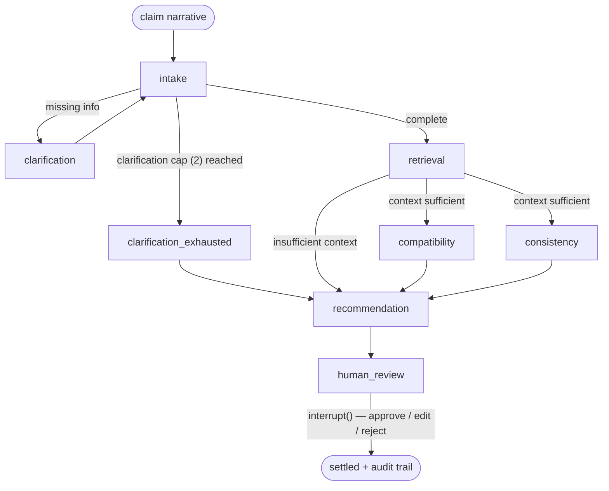

# insurance-claims-multiagent-rag

A multi-agent assistant that checks a described insurance event against the
filed conditions of a registered Brazilian motor-insurance product (SUSEP): a
LangGraph conditional graph with a clarification loop and parallel assessment
agents, hybrid RAG with cross-encoder reranking and domain-rule exclusion
co-retrieval, a mandatory human checkpoint, and a durable audit trail. FastAPI
over a Clean Architecture core. Every quality claim below is measured against a
hand-curated golden set and committed to `docs/`.

> **Setup, how to run it, and API usage** live in
> [`docs/GETTING_STARTED.md`](docs/GETTING_STARTED.md) — per-OS prerequisites,
> `.env` configuration, Docker/container management, and a full worked API
> session. This README is the project overview and its results.

The MIT license covers the source code in this repository only. Documents under
`data/policies/raw/` are published by their respective insurers and remain their
property — see [NOTICE.md](NOTICE.md).

## The problem, and the scope constraint

The corpus is 30 sets of *condições gerais* — the general and special conditions
of SUSEP-registered motor-insurance products across five product lines. Those
are **product templates filed with the regulator, not individual contracts**:
they carry no contracted coverage, insured amount, deductible, premium or policy
period. Given a described event and a registered product's filed conditions,
this system says whether the event is **consistent, inconsistent, or
insufficiently determined** against those conditions — it cannot, and does not,
say whether a real claim would be covered or denied. The full statement is
[`docs/SCOPE.md`](docs/SCOPE.md).

## Results

Every number is quoted from a committed report; follow the link for the method,
the pre-registered prediction and the findings.

| Stage | Metric | Result | Basis |
| --- | --- | --- | --- |
| Clause parsing | boundary / type accuracy | **98.0% / 92.0%** | 50-clause stratified sample, LLM-judged — [`PARSING.md`](docs/PARSING.md) |
| Retrieval | Recall@10 | **92.3%** | golden-set-v1, 117 scorable questions — [`RETRIEVAL_BENCHMARK.md`](docs/RETRIEVAL_BENCHMARK.md) |
| Retrieval | MRR | **0.806** | same |
| Retrieval | exclusion-clause recall | **100% (27/27)** | with exclusion co-retrieval; 92.6% without — [`EXCLUSION_CO_RETRIEVAL.md`](docs/EXCLUSION_CO_RETRIEVAL.md) |
| Retrieval | foreign-document rate | **0.0%** | metadata pre-filter — [`HYBRID_RETRIEVAL.md`](docs/HYBRID_RETRIEVAL.md) |
| End-to-end | verdict accuracy (3-class) | **56.9%** | 51 synthetic claims, one run; graph completion 100% — [`END_TO_END_EVALUATION.md`](docs/END_TO_END_EVALUATION.md) |
| End-to-end | faithfulness (LLM judge) | **93.8%** | 128 assertions, cross-family judge — [`END_TO_END_EVALUATION.md`](docs/END_TO_END_EVALUATION.md) |
| Latency | p50 / p95, end to end | **83 s / 250 s** | 46 assessments, one sample — [`PERFORMANCE.md`](docs/PERFORMANCE.md) |
| Cost | mean / p95 per assessment | **$0.013 / $0.037** | same run; one-off corpus index build ~$4–6 |

- **Parsing.** Figures are under the corrected boundary criterion; the
  conservative reading is 96.0% boundary (one disputed sample excluded), and the
  same corpus measures 84.0% / 86.0% under the original un-clarified criterion.
  See [`PARSING.md`](docs/PARSING.md).
- **End-to-end.** 56.9% is a single non-deterministic run over a small,
  single-author synthetic set. The system's characteristic error is
  over-abstention, not a wrong verdict — `incompatible` precision is 92.3% at
  50.0% recall. The value of this measurement is the failure catalogue behind
  it, which found and fixed a retrieval pre-filter defect (35.3% → 56.9% in the
  same pass). The compatibility node in isolation scores 88.1% on the 42
  verdict-labelled golden questions — [`COMPATIBILITY_ASSESSMENT.md`](docs/COMPATIBILITY_ASSESSMENT.md).
- **Latency and cost.** One sample, n = 46. About 72% of latency and 84% of cost
  is a single reasoning-model call, so both move with the model and the provider
  route — [`PERFORMANCE.md`](docs/PERFORMANCE.md).

The retrieval numbers are strong and reproducible byte-for-byte
(`make eval-retrieval-matrix`). The end-to-end number is an early, honest,
small-sample measurement — reported with its `n` and its caveats rather than
rounded up.

## Architecture

A Clean Architecture core (domain → application → infrastructure/presentation)
with **LangGraph confined to the infrastructure layer** — the domain and
application layers import no framework symbol, enforced by a test. The pipeline
splits deterministic work from model work deliberately: the metadata pre-filter,
the exclusion co-retrieval, the insufficient-context gate, the consistency
arithmetic checks and every confidence ceiling are plain Python; the LLM is used
only where judgement is unavoidable, and every compatibility assertion must cite
a retrieved clause or it is rejected and retried. The two assessment nodes run
as fixed parallel branches. Nothing reaches a final state without a person
approving, editing or rejecting the recommendation at the checkpoint.



`compatibility` and `consistency` run in one parallel superstep (alongside an
optional advisory prompt-injection scan, off by default); `recommendation`
consolidates but never re-decides; `human_review` is unconditional. Design
rationale, the deterministic/LLM boundary and a decision log are in
[`docs/ARCHITECTURE.md`](docs/ARCHITECTURE.md).

## Quickstart

The full path — per-OS notes, `.env` details, container management and a worked
API session — is [`docs/GETTING_STARTED.md`](docs/GETTING_STARTED.md). The short
version, from a clean clone, entirely through Docker Compose:

```bash
cp .env.example .env
# fill LLM_PROVIDER / LLM_BASE_URL / LLM_API_KEY / LLM_MODEL_FAST /
# LLM_MODEL_REASONING (and the matching provider pins) — the rest of
# .env.example's defaults already match the Compose services.

docker compose up -d postgres redis   # infra first
make fetch-corpus-artifacts           # pre-processed corpus (~10 MB) — skips the LLM parse
make build-index                      # chunks -> Postgres -> embeddings
docker compose up -d --build          # migrate (once), then api + worker
```

`make build-index`'s embedding step is a one-time ~41-minute local CPU pass
($0 in API cost). `make fetch-demo-artifacts` in place of `fetch-corpus-artifacts`
downloads a pre-computed cache so it replays in seconds instead — once the
maintainer has published that release ([`docs/GETTING_STARTED.md`](docs/GETTING_STARTED.md)).

```bash
curl -s -X POST localhost:8000/v1/assessments \
  -H 'Content-Type: application/json' \
  -d '{"raw_text": "Bati o carro na traseira de outro veículo ao tentar estacionar."}'
# -> 202 {"assessment_id": "<id>", "status": "pending"}

curl -s localhost:8000/v1/assessments/<id>
# status moves pending -> running -> awaiting_review, with the recommendation
# and its citations once ready
```

## What this system cannot do

- **It assesses registered products, not contracts.** The corpus holds no
  contracted coverage, insured amount, deductible, premium or policy period. A
  `compatible` verdict means the described event does not contradict a product's
  filed conditions — it does **not** mean a claim would be paid. No amount of
  retrieval or reasoning recovers a fact that was never in the source documents.
- **The evaluation is small and single-author.** 140 golden questions and 51
  synthetic claims, all selected, written and reviewed by the person who built
  the system; scorable retrieval questions cover 2 of the 5 product lines; the
  end-to-end run is one non-deterministic sample where a single claim moves
  overall accuracy by ~2 points. The numbers are measured and reproducible —
  they are not an independent benchmark ([`docs/EVALUATION.md`](docs/EVALUATION.md),
  "What this evaluation cannot establish").
- **It is not a fraud detector.** The consistency node flags internal
  contradictions in a narrative for a human to look at. Neither the data nor the
  method supports a fraud claim, and none is made.
- **It does not decide.** Every run stops at a human checkpoint before anything
  is recorded. The output is a recommendation with citations, for a person to
  approve, edit or reject.

## Where this sits

This is the author's third production-shaped multi-agent orchestration. The
first was an auto-insurance sales assistant built directly on the OpenAI SDK
with keyword-map retrieval; the second, a customer-loyalty WhatsApp assistant on
LangGraph + LangChain. Both shipped in production; neither is public. This one is
the most demanding of the three: a conditional graph with a self-capping
clarification loop, parallel assessment branches, an interrupt checkpoint,
hybrid RAG with reranking and a domain-rule co-retrieval step, and a
pre-registered evaluation behind every claim it makes. Career context:
[linkedin.com/in/warley-xavier-a8b8811b7](https://www.linkedin.com/in/warley-xavier-a8b8811b7).

## Documentation

| Doc | What it covers |
| --- | --- |
| [`GETTING_STARTED.md`](docs/GETTING_STARTED.md) | prerequisites, `.env`, running the stack, container management, API usage |
| [`SCOPE.md`](docs/SCOPE.md) | the canonical statement of what the system may and may not assert |
| [`ARCHITECTURE.md`](docs/ARCHITECTURE.md) | layer boundaries, graph topology, the deterministic/LLM split, decision log |
| [`DATA_SOURCES.md`](docs/DATA_SOURCES.md) | corpus selection, composition and known limitations |
| [`EVALUATION.md`](docs/EVALUATION.md) | the golden set, metric definitions, the second-reviewer pass |
| [`PARSING.md`](docs/PARSING.md) · [`RETRIEVAL_BENCHMARK.md`](docs/RETRIEVAL_BENCHMARK.md) · [`END_TO_END_EVALUATION.md`](docs/END_TO_END_EVALUATION.md) · [`PERFORMANCE.md`](docs/PERFORMANCE.md) | the measurements behind the results table |
| [`API.md`](docs/API.md) · [`DEPLOYMENT.md`](docs/DEPLOYMENT.md) | endpoint reference and the Compose stack's design |
